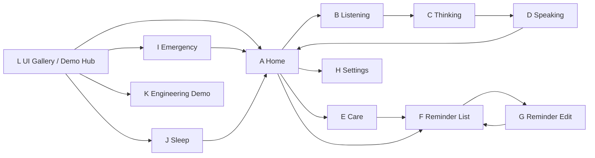

# LongPet Screen Index

> 画布统一为 1024×600。本文只定义 UI Demo 中允许的页面关系，不定义业务流程、后端接口或生产信号。

## 页面总览

| ID | 名称 | 用途 | 主要视觉元素 | 设计重点 | UI Demo 允许导航 |
| --- | --- | --- | --- | --- | --- |
| A | Home / 首页 | 机器宠物默认在场状态与三个高频入口 | 状态栏、大宠物脸、陪伴文案、3 个 96 px 按钮 | 脸必须是第一视觉中心；不能像 App Launcher | → Listening；→ Care；→ Reminder List；状态栏设置区 → Settings |
| B | Listening / 倾听 | 展示用户正在说话的视觉状态 | Listening 表情、左右声波、“我在听”、假文本卡 | 用静态表情也能理解正在倾听；明确文本仅为 UI 示例 | 返回 → Home；演示下一步 → Thinking |
| C | Thinking / 思考 | 展示系统正在组织回应的视觉状态 | Thinking 表情、“让我想一想……”、3 个轻反馈点 | 不使用技术加载器、百分比或频谱 | 返回 → Home；演示下一步 → Speaking |
| D | Speaking / 说话 | 展示宠物回应内容 | Speaking 表情、回复卡、轻声波 | 回复最多 3 行；脸与文案都清楚，不做聊天记录页 | → Home；演示循环可 → Listening |
| E | Care / 今日关怀 | 温和汇总喝水、用药、活动与陪伴 | 主关怀卡、用药卡、活动/相遇卡 | 像陪伴摘要，不像数据 Dashboard | 返回 → Home；→ Reminder List |
| F | Reminder List / 提醒列表 | 查看提醒与完成状态 | 3 个大列表项、时间、事项、图标+状态文字 | 已完成/待完成/错过不能只靠颜色 | 返回 → Home；列表项或新建 → Reminder Edit |
| G | Reminder Edit / 提醒编辑 | 只展示提醒编辑视觉 | 大时间区、类型分段、重复分段、备注、保存/取消 | 所有字段可一眼理解；不设计调度或存储 | 保存/取消 → Reminder List；保存可显示 Toast |
| H | Settings / 设置 | 调整视觉演示值与查看设备类入口 | 2×3 设置卡、滑块、状态文字、右箭头 | 六项保持大触控，不使用密集桌面设置列表 | 返回 → Home；卡片仅切换本地视觉 Demo 状态 |
| I | Emergency / 紧急状态 | 强提示用户确认安全或选择联系家人 | Alert 图形、44 px 问题、两个 112 px 按钮 | 两秒内理解；无多余信息；联系操作不伪装成已执行 | “我没事” → Home；“联系家人” → 视觉确认层；Demo Hub 可进入 |
| J | Sleep / 睡眠 | 夜间低刺激休眠展示 | 低亮时间、Sleep 表情、单句唤醒提示 | 低刺激、无闪烁、无多个操作 | 整屏单击 → Home；Demo Hub 可进入 |
| K | Engineering Demo / 工程演示 | 比赛中展示平台与假指标 | `DEMO DATA`、平台卡、模块卡、假指标网格 | 假数据标识必须持续可见；不采集真实系统数据 | 返回 → Demo Hub 或 UI Gallery；不从老人 Home 暴露 |
| L | UI Gallery / UI 展廊 | 集中审核表情、组件、Token 与页面入口 | 10 表情网格、组件状态、颜色/字体/间距 | 明确 `DESIGN REVIEW`；用于设计审核而非老人使用 | → 所有页面；页签间切换 Pet Faces / Components / Tokens |

## UI Demo 导航图

## 页面家族

### 陪伴状态家族

Home、Listening、Thinking、Speaking、Sleep 共用同一套 Pet Face 比例与视觉中心。状态变化由眼睛、嘴部、声波和短文案共同表达；不依赖动画或技术状态词。

### 日常关怀家族

Care、Reminder List、Reminder Edit、Settings 共用：64 px 状态栏、96 px 应用标题栏、80×80 返回触控区、32 px 页面边距和 Surface 卡片系统。

### 强提示家族

Emergency 不继承普通标题栏和返回按钮，安全问题直接成为最高层级。任何视觉确认都只能说明 UI Demo 中“已选择”，不能暗示真实电话或消息已经发送。

### 展示审核家族

Engineering Demo 和 UI Gallery 不面向老人。两页必须分别持续显示 `DEMO DATA` 与 `DESIGN REVIEW`，且只允许从 Demo Hub / Gallery 进入，不能占用 Home 的三个主要入口。

## 允许的本地 UI Demo 行为

- 页面切换。
- 按钮 pressed / disabled 视觉状态。
- 在十种宠物表情之间切换。
- Slider、分段选择、Reminder Item 状态的纯视觉演示。
- 显示写死的示例文本、关怀数字、工程假数据与 Toast。

## 明确不属于导航或交互范围

- 真实语音识别、录音、播放与 AI 回复。
- 真实提醒创建、定时、存储或通知。
- 网络连接、天气请求、联系人读取或联系家人。
- CPU / RAM / FPS / 推理耗时采集。
- 摄像头、视觉、硬件控制与系统服务。
- 为未来业务集成预留的 signal/slot、Service、Controller、Model、Repository 或接口。

## 静态草图索引

关键页面草图位于 `docs/mockups/`，均使用 1024×600 viewBox：

- `01-home.svg`：首页视觉重心与底部三个入口。
- `02-listening.svg`：倾听表情、示例文本与取消按钮。
- `03-speaking.svg`：宠物与回复内容的左右结构。
- `04-care.svg`：非 Dashboard 的今日关怀摘要。
- `05-reminders.svg`：提醒三状态与列表密度。
- `06-emergency.svg`：紧急信息层级与超大按钮。
- `07-sleep.svg`：夜间低刺激展示。
- `08-ui-gallery.svg`：十种宠物表情的统一性审核。
